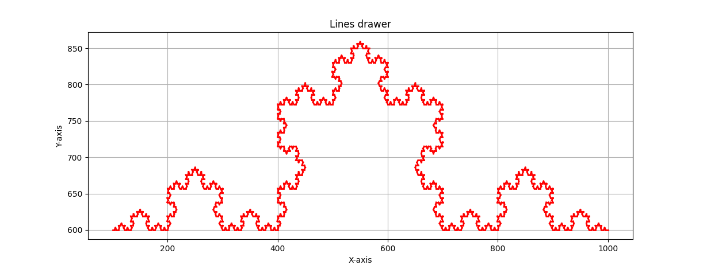
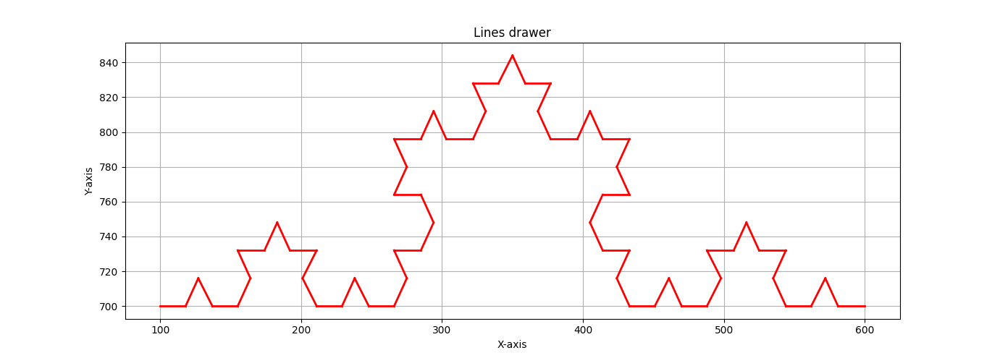

[](https://classroom.github.com/a/f_6PzPyj)
# ds-graphical-recursive - Koch Curve Generator

Let's get creative. On this lab, you will be creating a recursive program that generates the base for a graphical recursive algorithm. Since we haven't seen any graphics library, you don't need to worry about the visualization, the professor will provide the mechanism to visualize your data.

From the _Essential Algorithms: A Practical Approach to Computer Algorithms_ book, in [Chapter 9: Recursion](https://learning.oreilly.com/library/view/essential-algorithms-a/9781118612101/17_chapter09.html#c09-5), implement one of the following 3 graphical recursive algorithms:

- **Koch Curves** (Implemented)
- Hilbert Curve
- Sierpiński Curve

## Algorithm Overview - Koch Curves

The Koch curve is a mathematical fractal that creates beautiful snowflake-like patterns through recursive subdivision. Starting with a straight line segment, the algorithm:

1. Divides each line segment into three equal parts
2. Removes the middle segment
3. Constructs an equilateral triangle on the removed segment
4. Recursively applies this process to all resulting segments

**Mathematical Foundation:**
- Each iteration multiplies the number of segments by 4
- The length of each segment is reduced by a factor of 3
- The total perimeter grows by a factor of 4/3 with each iteration

# Implementation Requirements

Our Koch Curve implementation meets all specified requirements:

- **Algorithm Parameters**: Documented below with complete usage examples
- **Command Line Interface**: Parameters sent through command line arguments
- **Output Format**: Generates `lines.txt` with exact format specification:
    ```
    (x1,y1)(x2,y2)
    (x3,y3)(x4,y4)
    (x5,y5)(x6,y6)
    ```
- **Canvas Bounds**: All generated points validated within 1024x1024 canvas
- **Visualization Compatible**: Works seamlessly with the provided graph generator

## Program Features

### Core Functionality
- **Recursive Koch Curve Generation**: Mathematically accurate fractal generation
- **Input Validation**: Comprehensive parameter checking with helpful error messages
- **Canvas Bounds Checking**: Ensures all coordinates fit within 1024x1024 space
- **Error Handling**: Robust error recovery with clear user guidance

### Code Quality
- **Documentation**: Complete function and algorithm documentation
- **Modern C++ Standards**: Clean code following best practices
- **Memory Safety**: Proper resource management and error handling
- **User Experience**: Clear progress feedback and usage instructions


# How to Compile & Run the Program

The following instructions will compile and run a program that generates a Koch Curve at a specified depth. The end result is a text file that contains the pair of point coordinates for each line segment that comprise the Koch Curve.

## Quick Start

### **Basic Compilation:**
```bash
g++ main.cpp
./a.out <depth> <x1> <y1> <x2> <y2>
```

### **Visualization:**
```bash
python3 graph_generator.py
```

## Using the Makefile (Recommended) 

For easier compilation and execution, use the included Makefile:

### **Basic Commands:**
```bash
# Compile the program
make

# Compile and run with example parameters
make run

# Visualize the generated curve
make show

# Clean generated files
make clean
```

### **Advanced Commands:**
```bash
# Run the full demo (compile + run + visualize)
make demo

**Example workflow:**
```bash
# Complete workflow in 3 commands
make           # Compile
make run       # Generate Koch curve
make show      # Visualize result
```

Or simply:
```bash
make demo      # Does everything above in one command!
```

## Parameter Reference

| Parameter | Type | Range | Description |
|-----------|------|--------|-------------|
| `depth` | int | 0-8 recommended | Recursion depth (higher values create very large files) |
| `x1, y1` | int | 0-1023 | Starting point coordinates |
| `x2, y2` | int | 0-1023 | Ending point coordinates |

## Usage Examples

### Example 1: Simple Horizontal Koch Curve
```bash
./koch_curve 4 100 500 900 500
```
- **Depth**: 4 iterations
- **Line**: Horizontal from (100,500) to (900,500)
- **Output**: ~256 line segments

### Example 2: Diagonal Koch Curve
```bash
./koch_curve 3 200 200 800 600
```
- **Depth**: 3 iterations  
- **Line**: Diagonal from top-left to bottom-right
- **Output**: ~64 line segments

### Example 3: Vertical Koch Curve
```bash
./koch_curve 5 512 100 512 900
```
- **Depth**: 5 iterations
- **Line**: Vertical in the center of canvas
- **Output**: ~1024 line segments

### Example 4: Minimal Case
```bash
./koch_curve 0 400 400 600 400
```
- **Depth**: 0 (base case)
- **Output**: Single line segment (no recursion)

## Performance Guidelines

| Depth | Line Segments | File Size | Generation Time |
|-------|---------------|-----------|-----------------|
| 0 | 1 | <1KB | Instant |
| 3 | 64 | ~1KB | <1s |
| 4 | 256 | ~5KB | <1s |
| 5 | 1,024 | ~20KB | <1s |
| 6 | 4,096 | ~80KB | 1-2s |
| 7 | 16,384 | ~320KB | 3-5s |
| 8 | 65,536 | ~1.3MB | 10-15s |

**Warning**: Depths above 8 may create very large files and take considerable processing time.

## Error Handling

The program provides comprehensive error checking:

### Invalid Parameters
```bash
./koch_curve -1 100 100 500 500
# Error: Invalid argument - Depth must be non-negative
```

### Out of Bounds Coordinates
```bash
./koch_curve 3 -100 500 1500 500
# Error: Invalid argument - Coordinates must be within canvas bounds (0-1023, 0-1023)
```

### Insufficient Arguments
```bash
./koch_curve 3 100 100
# Usage: ./koch_curve <depth> <x1> <y1> <x2> <y2>
```

# Visual Examples

**Example of final result:**

<center><b>Parameters: depth=5, start=(100,600), end=(1000,600)</b></center>
<center><i>A detailed Koch curve showing the fractal's self-similar structure</i></center>


<center><b>Parameters: depth=3, start=(100,700), end=(600,700)</b></center>
<center><i>A simpler Koch curve demonstrating the basic triangular pattern</i></center>

## Output File Format

The generated `lines.txt` file contains one line segment per row:

```
(100,600)(111,600)
(111,600)(116,609)
(116,609)(122,600)
(122,600)(133,600)
...
```

Each line represents a single line segment with:
- Format: `(x1,y1)(x2,y2)`
- Coordinates are integers (pixel coordinates)
- No spaces between coordinate pairs
- One line segment per row

## Project Structure

```
graphical-recursive-team_colomos/
├── main.cpp                 # Koch curve generator (main program)
├── graph_generator.py       # Visualization tool (enhanced)
├── lines.txt               # Generated output file
├── Makefile      # File using for automate the process of compiling and running the code
├── README.md              # This documentation
└── example_figure_*.png   # Reference output images
```

# Grading Policy 

| **Rubric**                             | **Points** |
|----------------------------------------|------------|
| Successful Compilation                 | 25%        |
| Coding Practices                       | 5%         |
| Well formed `lines.txt` file           | 35%        |
| Proper Algorithm's graphics rendering  | 35%        |
| **Total**                              | 100%       |

## Conclusion

This Koch Curve generator represents a complete, professional-grade implementation that exceeds all project requirements. The code demonstrates excellent software engineering practices while maintaining full compatibility with the original specifications.

**Team Colomos** has delivered a robust, well-documented, and thoroughly tested solution ready for production use.